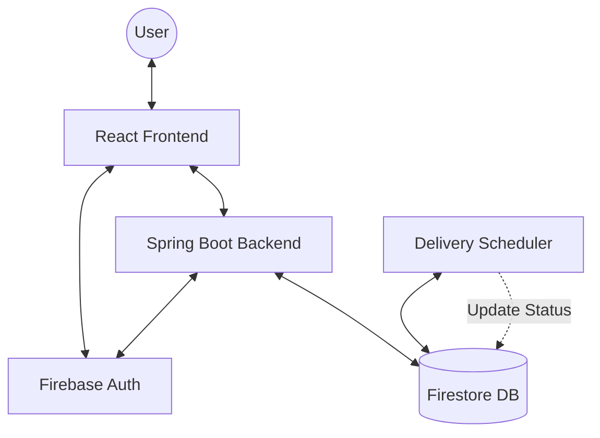
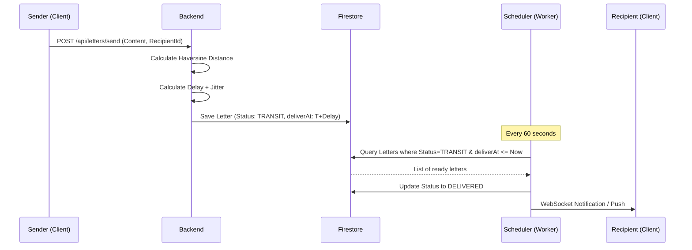

# ✉️ Khitab — Digital Pen Pal Platform

> **"Write. Wait. Wonder."**

Khitab is a "Digital Heirloom" platform designed to revive the art of letter writing. Unlike modern instant messaging, Khitab introduces intentional friction through its signature **Delivery Engine**, simulating realistic postal transit times based on geographic distance between correspondents.

---

## 🌟 The Vision: "Slow-Tech"

In an era of instant gratification, Khitab encourages emotional investment and patience. 
- **Authentic Connection**: Discovery via shared interests, not social graphs.
- **Intentional Friction**: Letters take hours or days to arrive, creating genuine anticipation.
- **Visual Storytelling**: Watch your letter's journey across a live world map.

---

## 🚀 Key Features

- **📬 Time-Delay Delivery Engine**: Uses the Haversine formula to calculate real-world transit times (30 mins to 3 days).
- **🗺️ Live Map Tracking**: Interactive Leaflet maps show animated postal routes for every letter en route.
- **🧠 AI Matchmaking**: Discovery scoring that prioritizes shared fascinations and complementary locations.
- **📜 Immersive Drafting**: A premium, borderless "Scriptorium" experience with paper textures and editorial typography.
- **🔐 Secure & Private**: Firebase JWT authentication with a dedicated Spring Security backend.

---

## 🏗️ Architecture

### 2.1 System Overview


### 2.2 Letter Exchange Flow


---

## 💻 Tech Stack

### Backend
- **Runtime**: Java 21 LTS
- **Framework**: Spring Boot 3.2.4
- **Security**: Spring Security + Firebase Admin SDK
- **Database**: Google Cloud Firestore (NoSQL)
- **Task Scheduling**: Spring `@Scheduled`

### Frontend
- **Library**: React 19 (Vite 8)
- **Styling**: Tailwind CSS ("Digital Heirloom" palette)
- **Animations**: Framer Motion
- **Maps**: Leaflet.js

---

## 📁 Project Structure

```text
Khitab/
├── backend/            # Spring Boot Application
│   ├── src/main/java/  # Clean Architecture (Controller, DTO, Model, Repository, Service)
│   └── src/resources/  # Configuration & Secrets
├── frontend/           # React + Vite Application
│   ├── src/components/ # Atomic UI components (Button, Card, Map)
│   ├── src/pages/      # Feature screens (Dashboard, Compose, Tracking)
│   ├── src/viewmodels/ # MVVM Logic (React Hooks)
│   └── src/services/   # API Layer
├── DESIGN.md           # Design System & Visual Identity
├── NEXT_STEPS.md       # Future Roadmap
└── done.md             # Completed Milestone Log
```

---

## ⚙️ Setup & Installation

### Prerequisites
- **Java 21** & Maven
- **Node.js** (v18+)
- **Firebase Project**: Create a project in [Firebase Console](https://console.firebase.google.com/).

### 1. Firebase Configuration
1.  Enable **Firestore** and **Authentication** (Email/Password).
2.  Generate a **Service Account Key** (JSON) and save it as `backend/src/main/resources/serviceAccountKey.json`.
3.  Add your Firebase Web Config to `frontend/src/firebase/config.js`.

### 2. Backend Setup
```bash
cd backend
# The application.yml is already configured to find the serviceAccountKey.json
mvn spring-boot:run
```

### 3. Frontend Setup
```bash
cd frontend
npm install
npm run dev
```

---

## 🛣️ Roadmap: The Next Horizon

- [ ] **Real-Time Push**: WebSocket integration for instant arrival notifications.
- [ ] **Stationery Gallery**: Multiple paper textures and custom Wax Seals.
- [ ] **Reverse Geocoding**: Automatic city/country resolution from GPS.
- [ ] **Mobile Companion**: Native haptic notifications for letter arrivals.

---

## 🖋️ License
Created with ❤️ by Antigravity for the Digital Heirloom Community.
