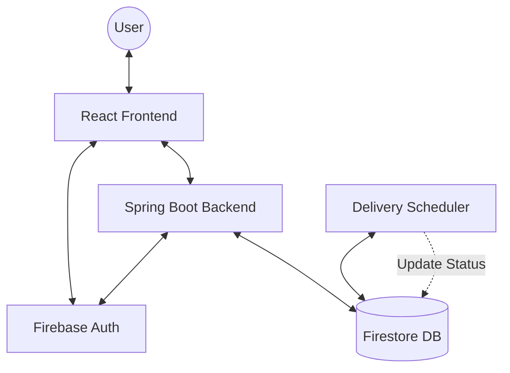
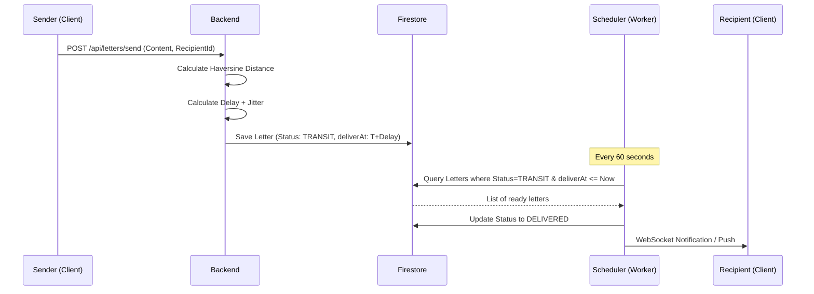

# Khitab: Digital Pen Pal Platform
## Project Report & Technical Specification

Khitab is a "Digital Heirloom" platform designed to revive the art of letter writing. Unlike instant messaging, Khitab introduces intentional friction through its signature **Delivery Engine**, which simulates realistic postal transit times based on geographic distance.

---

## 1. Technology Stack

### Backend (Server)
- **Runtime**: Java 21 LTS
- **Framework**: Spring Boot 3.2.4
- **Security**: Spring Security + Firebase Admin SDK (JWT Authentication)
- **Database**: Google Cloud Firestore (NoSQL)
- **Real-time**: Spring WebSockets (STOMP)
- **Task Scheduling**: Spring `@Scheduled` for Delivery Engine worker

### Frontend (Web)
- **Framework**: React 19 (Vite 8)
- **Styling**: Tailwind CSS (Earth-toned "Digital Heirloom" palette)
- **Animations**: Framer Motion (Envelope unfolding, entrance transitions)
- **Maps**: Leaflet.js + React-Leaflet (OpenStreetMap tiles)
- **State Management**: React Context (Auth) + MVVM Architecture
- **Data Fetching**: TanStack Query (React Query) + Axios

---

## 2. Architectural Diagrams

### 2.1 System Overview

### 2.2 Letter Exchange Flow

---

## 3. Data Models

### 3.1 UserProfile
Stored in `users` collection.

| Field | Type | Description |
| :--- | :--- | :--- |
| `uid` | String | Unique Firebase UID |
| `penName` | String | Display name for the platform |
| `email` | String | User's email address |
| `latitude` | Double | Geolocation Latitude |
| `longitude` | Double | Geolocation Longitude |
| `country` | String | Country of residence |
| `city` | String | City of residence |
| `interests` | List<String>| Tags used for matchmaking |
| `bio` | String | Brief introduction |
| `avatarUrl` | String | Profile image or Wax Seal URL |

### 3.2 Letter
Stored in `letters` collection.

| Field | Type | Description |
| :--- | :--- | :--- |
| `id` | String | UUID |
| `senderId` | String | UID of the sender |
| `receiverId` | String | UID of the recipient |
| `content` | String | HTML/Text content of the letter |
| `sentAt` | Long | Timestamp (ms) when letter was sent |
| `deliverAt` | Long | Timestamp (ms) when letter will be delivered |
| `status` | String | `TRANSIT`, `DELIVERED`, `READ` |

---

## 4. Delivery Engine & Formulas

### 4.1 Geographic Distance (Haversine Formula)
The engine calculates the "As the Crow Flies" distance between two coordinates using the Haversine formula:

$$a = \sin^2\left(\frac{\Delta\phi}{2}\right) + \cos\phi_1 \cdot \cos\phi_2 \cdot \sin^2\left(\frac{\Delta\lambda}{2}\right)$$
$$c = 2 \cdot \operatorname{atan2}(\sqrt{a}, \sqrt{1-a})$$
$$d = R \cdot c$$

*Where $R$ is Earth's radius (6371 km).*

### 4.2 Distance-Based Delay Matrix
The base delay is determined by the distance calculated:

| Distance Range | Base Delivery Time |
| :--- | :--- |
| < 50 km (Same City) | 30 Minutes |
| 50 - 500 km (Regional) | 2 Hours |
| 500 - 2000 km (National) | 6 Hours |
| 2000 - 7000 km (Continental) | 1 Day |
| > 7000 km (Global) | 3 Days |

### 4.3 Randomized Jitter
To simulate real-world postal variability, a random jitter of **0-20%** is added to the base delay:
`Final Delay = Base Delay * (1.0 + random(0.0, 0.2))`

---

## 5. API Reference (Core Endpoints)

| Method | Endpoint | Description |
| :--- | :--- | :--- |
| `POST` | `/api/auth/register` | Sync Firebase user to local Firestore profile |
| `POST` | `/api/letters/send` | Compose and send a letter (starts delivery engine) |
| `GET` | `/api/letters/mailbox` | Fetch all letters for the current user |
| `GET` | `/api/explore/users` | Discovery matching based on shared interests |

---

## 6. Design System: Digital Heirloom
The visual identity of Khitab is defined by "Poetic Slow-Tech":
- **Colors**: Sage Greens, Parchment Creams, and Wax Seal Crimsons.
- **Typography**:
    - Headings: `Noto Serif` (Traditional, Academic)
    - Body: `Manrope` (Clean, Modern readability)
- **UI Rules**: High-elevation cards, glassmorphism overlays, and borderless design to emphasize paper texture.
